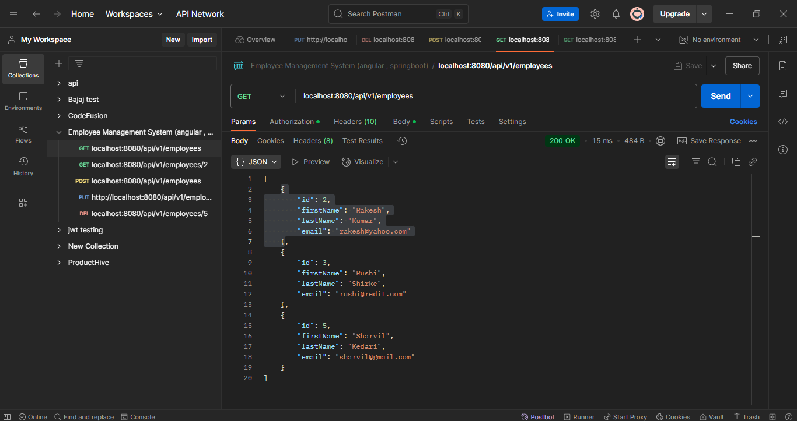
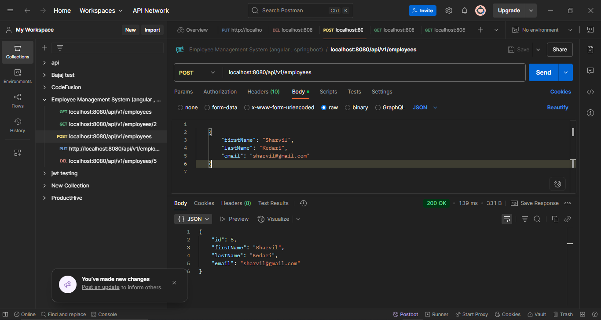
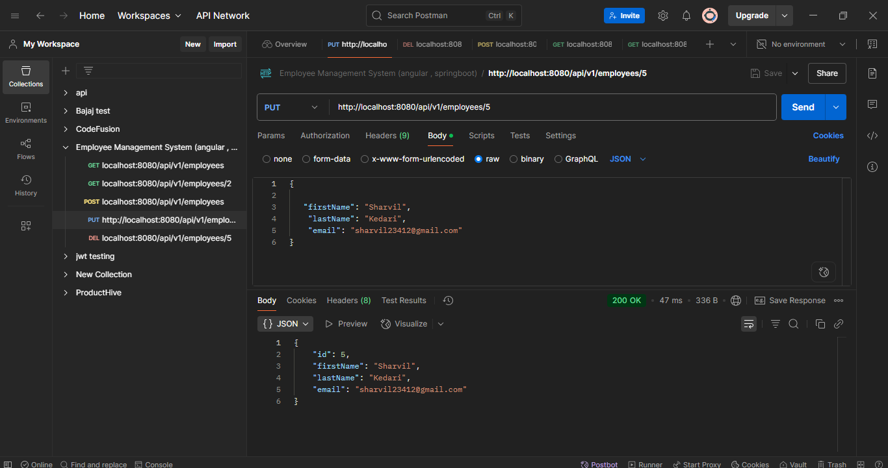
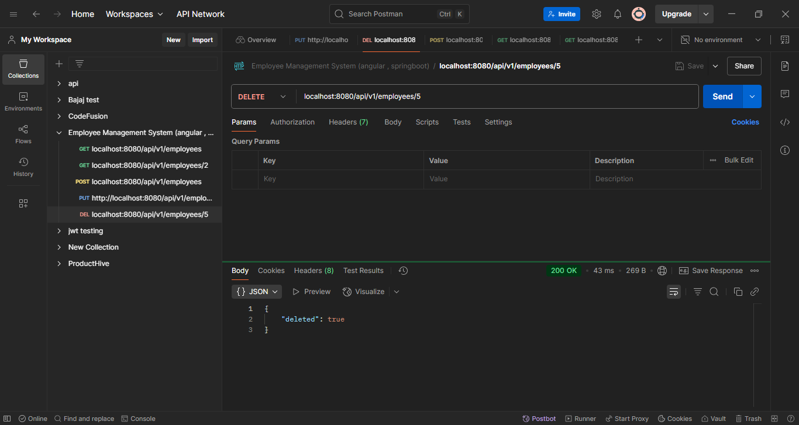
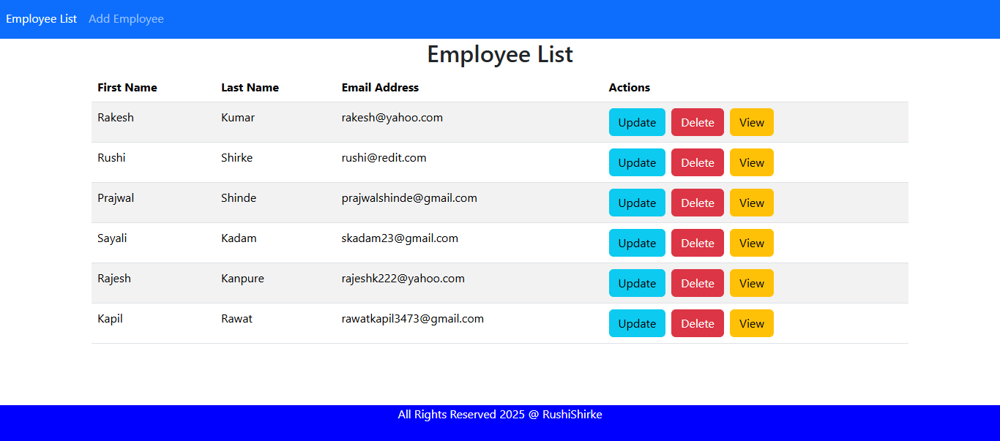
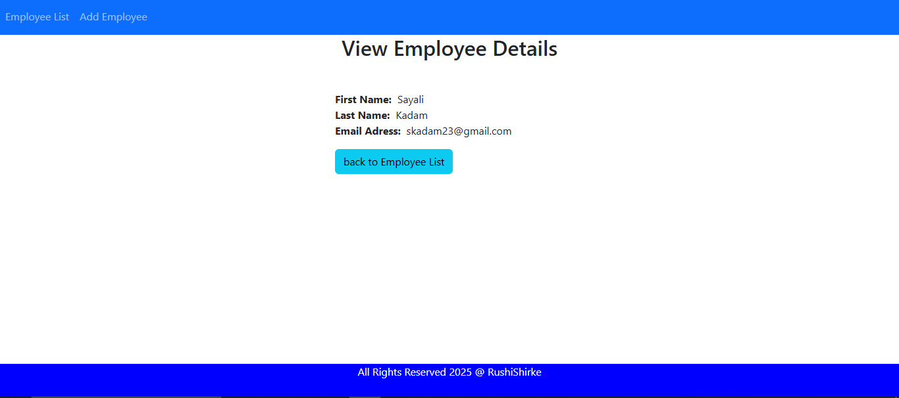
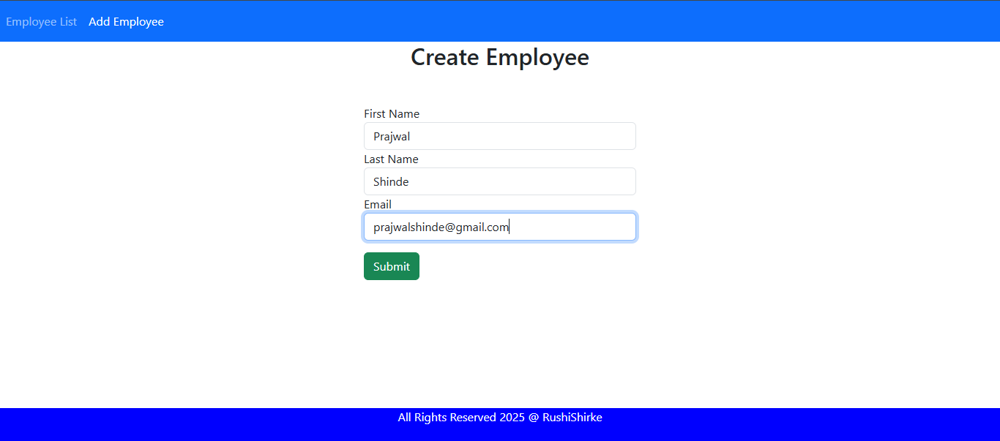
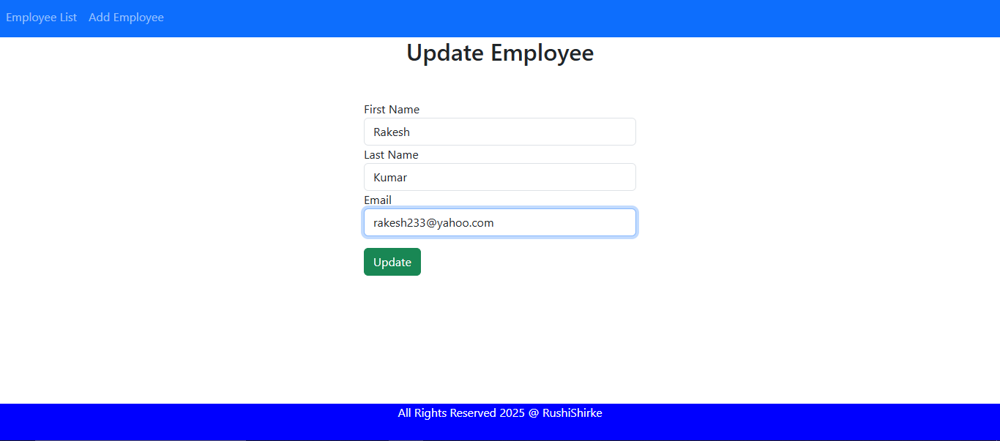

# 👨‍💼 Employee Management System

A full-stack Employee Management System built with Angular (frontend), Spring Boot (backend), and MySQL (database). It includes RESTful CRUD APIs tested using Postman.

This Employee Management System allows users to manage employee records through a modern web interface.  
The backend is developed with Java Spring Boot and MySQL, while the frontend is built using Angular.  
It supports Create, Read, Update, and Delete (CRUD) operations and is fully tested using Postman.
## ✨ Features

- Add new employee
- Get all employees
- Get a specific employee by ID
- Update employee details
- Delete employee
- RESTful APIs tested with Postman
- Angular frontend with form validation

## Screenshots

[📸 Postman API Screenshots]

### 🔹 Get All Employees

### 🔹 Get One Employee

### 🔹 Add Employee

### 🔹 Update Employee

### 🔹 Delete Employee

[📸 Website Screenshots]

### 🔹 Get All Employees

### 🔹 Get One Employee

### 🔹 Add Employee

### 🔹 Update Employee

## Installation

1. Clone or download the repository.
2. Open the `index.html` file in your web browser.
3. Click the button to see the modal popup in action.
    ## 🚀 How to Run the Project

### 🔧 Backend (Spring Boot)
1. Clone the repository
2. Import the backend project in your IDE
3. Update `application.properties` with your MySQL credentials
4. Run the application

### 🌐 Frontend (Angular)
1. Navigate to the Angular project folder
2. Run `npm install`
3. Run `ng serve` to start the Angular development server

### 🧪 API Testing
- Use Postman to test the APIs
- The backend runs on `http://localhost:8080`
- The frontend runs on `http://localhost:4200`
## 🛠️ Technologies Used

- Angular
- Java Spring Boot
- MySQL
- Postman
- REST API
